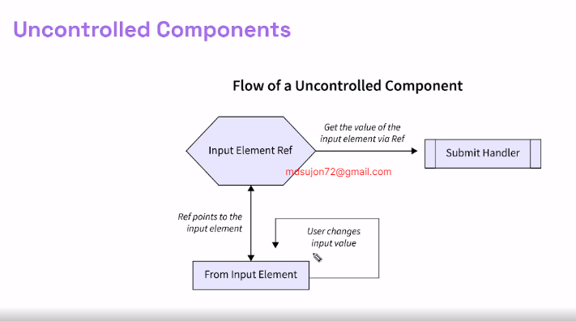

# Module 46 - React Core Concept (part 3)

## 46-1 Handle form with onSubmit and access field data

1. use form tag (name) to get value and onSubmit handler with event (e) , access e.target.[name of the input field].value
2. controlled element: use individual field state to store data for each field
3. controlled element : one object holding all the input fields value
4. uncontrolled element: use useRef to access input field value
5. use hook to handle states and submit and error. example react hook form
6. Reusable component

## What is `useRef` in React?

`useRef` is a React hook that lets you reference a value that's not needed for rendering.
`const ref = useRef(initialValue)` is a function that returns an object with a `current` property that contains the current value of the ref.

_Parameters_

`initialValue` is the initial value of the ref.

- The value you want the Ref object's current property to be initially.
- It can be a value of any type.
- This argument is ignored after the initial render.

`return`

- Returns an object with a single property current.
- Initially, it's set to the initialValue you have passed. You can later set it to something else.
- if you pass the ref object to react as a attribute to a JSX node, React will set its current property.
- On the next render, useRef will return the same object.

`Pitfall`

- You can mutate the ref.current property. Unlike state, it is mutable.
- When you change the ref.current property, React does not re-render your component.
- In strict Mode, React will call your component function twice in order to help you find accidental impurities. This is development only behaviour and does not affect production, Each ref object will be created twice, but one of the versions will be discarded.

## Controlled Components

In a controlled component, the state of the form elements is controlled by react. the value of the input is set through the component's state. and is updated through event handlers.

When the input value changes, the state is updated , and react re-renders the component to reflect the new value.

Controlled components offer more controll over the form's behavior and provide a clear data flow.

## Uncontrolled Components

In an uncontrolled component, the form element's state is managed by the DOM rather than react. You can directly access the dom element using reference after rendering.

Thus uncontrolled components do not depend on any state of input elements or any event handler. This type of component does not care about real-time inpute changes.

